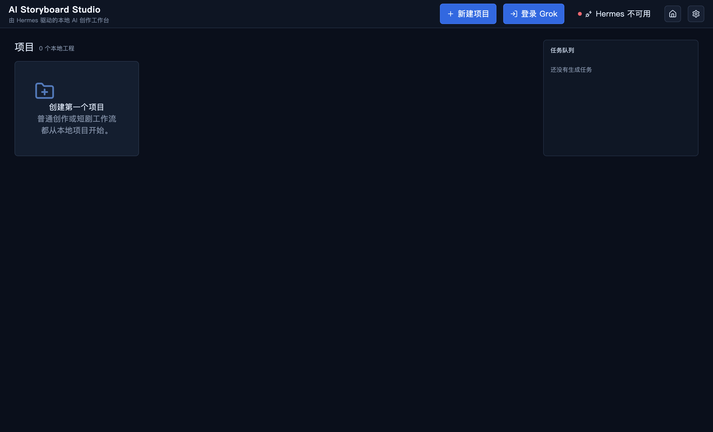

# AI Storyboard Studio

Local-first desktop workspace for AI image generation, video generation, and multi-shot storyboarding. It combines an Electron canvas with project assets, generation queues, and a Hermes-powered bridge to xAI media models.

> **Status:** early open-source release. The application is usable, but packaging and provider compatibility are still evolving. It is an independent community project and is not affiliated with, endorsed by, or sponsored by Nous Research or xAI.



## Why this project exists

Generating one image is easy; keeping characters, locations, props, prompts, and adjacent shots consistent across a story is not. AI Storyboard Studio keeps those pieces in one local project:

- organize character, scene, prop, image, and video assets;
- generate or edit images with up to three reference images;
- create text-to-video, image-to-video, and multi-reference video jobs;
- extend a video's final frame into the next shot;
- plan episodic stories with per-shot duration, aspect ratio, resolution, dialogue, and references;
- run the full workflow offline in Mock mode without consuming provider credits.

Project metadata and generated media stay on the local machine. OAuth credentials are managed by Hermes and are not exposed to the Electron renderer.

## Technology

- Electron, React, TypeScript, Vite
- Zustand and React Flow
- SQLite through Electron's built-in `node:sqlite`
- Python bridge for the local Hermes Agent runtime

## Requirements

The actively supported target is Windows 10/11.

- Node.js 22 or newer
- npm 10 or newer
- Python 3.11–3.13
- [Hermes Agent](https://github.com/NousResearch/hermes-agent) for live Grok generation
- An xAI account with access to the requested models

Mock mode does not require Hermes or an xAI account.

## Development

```powershell
git clone <repository-url>
cd ai-storyboard-studio
npm install
npm run dev
```

On Windows, `Run-Development.cmd` performs the install and starts the development server.

Run the local checks:

```powershell
npm run check
```

## Connecting Hermes

1. Install Hermes Agent using its official instructions.
2. In Hermes, add the xAI OAuth provider:

   ```powershell
   hermes auth add xai-oauth
   ```

3. Start AI Storyboard Studio and open **Settings**.
4. Select **Hermes OAuth** for a local CLI installation, or **Local HTTP** for a compatible local service.
5. Use **Mock** to explore the interface without a provider connection.

The source repository deliberately does not include Hermes, Python, OAuth credentials, cookies, user databases, or generated media. `scripts/prepare-hermes-runtime.ps1` is an optional maintainer utility for producing a self-contained Windows build from an existing local Hermes installation. Any redistributed bundle must preserve all applicable third-party notices and licenses.

## Supported workflows

| Workflow | Default model | Current limits |
| --- | --- | --- |
| Text to image | `grok-imagine-image-quality` | 1K/2K; repeated single-image requests |
| Image edit | `grok-imagine-image-quality` | 1–3 input images |
| Text to video | `grok-imagine-video` | 1–15 seconds; 480p/720p |
| Image to video | `grok-imagine-video-1.5-preview` | One first-frame image; 1–15 seconds |
| Multi-reference video | `grok-imagine-video` | Up to seven images; 1–10 seconds |
| Video extension | `grok-imagine-video` | MP4 input; add 2–10 seconds |

Provider capabilities and model IDs may change. The application reads the available model catalog from Hermes when possible and uses local defaults only as a fallback.

## Story workflow

1. Create a story project.
2. Import or generate character, scene, and prop references.
3. Add episodes and shots.
4. Set each shot's action, camera movement, dialogue, duration, aspect ratio, and references.
5. Generate one shot or process the episode sequentially.
6. Export the story structure as JSON.

The generation strategy chooses video extension when continuing a previous clip, image-to-video when a first frame is present, multi-reference video when reference assets are selected, and text-to-video otherwise.

## Local data and privacy

Application data is stored below Electron's per-user data directory:

```text
AIStoryboardStudio/
  database.sqlite
  projects/<projectId>/
    assets/
    generations/images/
    generations/videos/
    thumbnails/
  logs/
```

Before reporting a bug, remove private prompts, media, account details, and log content that you do not want to publish.

## Security

Please do not open a public issue for a suspected credential leak or exploitable vulnerability. Follow [SECURITY.md](SECURITY.md) instead. Never commit `.env` files, OAuth material, cookies, databases, logs, or generated private media.

## Roadmap

- cross-platform runtime discovery and packaging;
- automated subtitles, voice, and final episode assembly;
- stronger test coverage for database migrations and IPC validation;
- provider adapters with explicit capability negotiation;
- improved accessibility and English localization.

## Contributing

See [CONTRIBUTING.md](CONTRIBUTING.md). Small, focused pull requests with a reproducible test are easiest to review.

## License

AI Storyboard Studio is available under the [MIT License](LICENSE). Hermes Agent is a separate MIT-licensed project from Nous Research. Grok and xAI names and model identifiers belong to their respective owners. See [THIRD_PARTY_NOTICES.md](THIRD_PARTY_NOTICES.md).

---

## 中文简介

AI Storyboard Studio 是一款本地优先的 AI 图片、视频与短剧分镜桌面工作台。它将角色、场景、道具、首帧、台词和镜头参数集中在同一工程中，并通过本地 Hermes Agent 连接 xAI 媒体模型。

当前属于早期开源版本，主要支持 Windows。源码仓库不包含 Hermes 运行时、登录凭据、Cookie、用户数据库或生成媒体；没有 Hermes 时可以使用 Mock 模式体验完整工作流。
